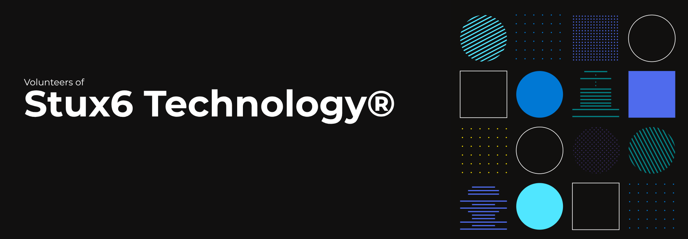

**This initiative within Stux6 is a professional volunteer core that is non-profit yet uncompromising in its engineering discipline. Without being tied to any official authority, it undertakes the most complex system architectures and low-level projects with absolute, informal seriousness. Our sole motivation is technical excellence; our success stems not from hierarchy, but from the weight of the technical burden we voluntarily undertake. We are a cold collective building the digital infrastructure of the future without expecting anything in return—simply because we can.**
